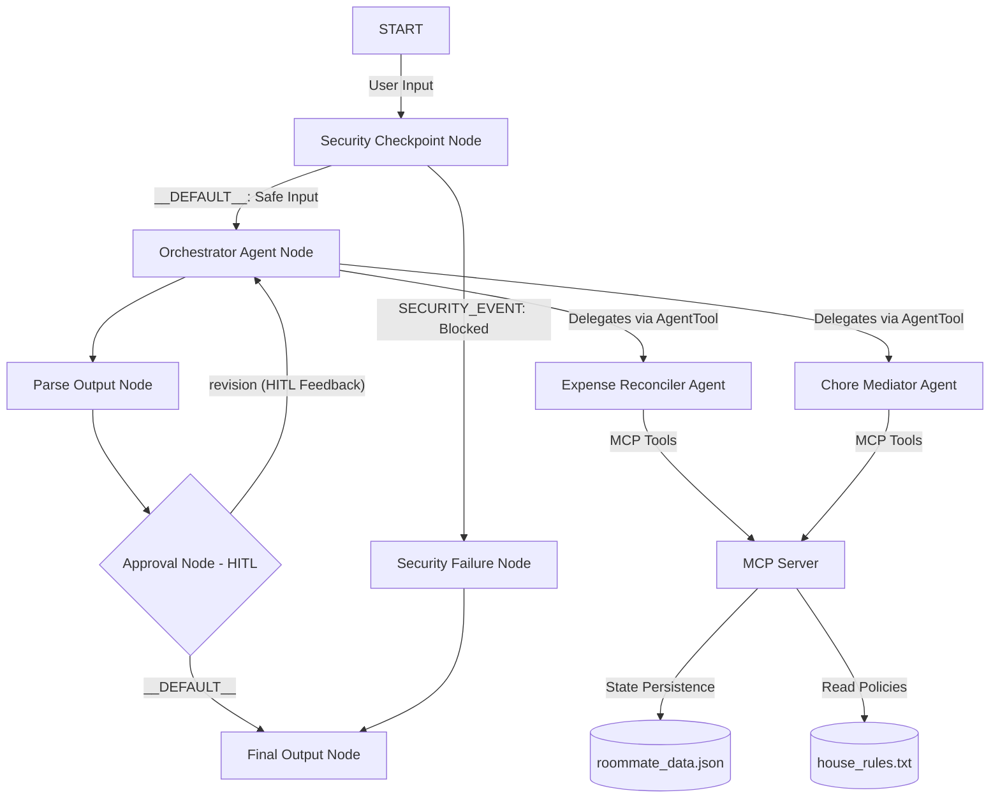

# Roommate Mediator Agent 🧑‍💼

A secure, multi-agent assistant designed to split expenses, rotate chore schedules, mediate household disputes, and keep the peace in shared living spaces.

---

## Architecture Diagram



---

## Features

- **Multi-Agent Orchestration**: Main orchestrator delegates tasks to specialized sub-agents via `AgentTool`.
- **MCP Server (STDIO)**: Integrates 8 domain-specific tools (balancing expenses, logging payments, generating Venmo links, tracking and rotating chores, and checking house rules).
- **Security Checkpoint**: PII scrubbing (emails, phones, credit cards), prompt injection block, and domain financial cap protection ($5,000 threshold).
- **Human-in-the-Loop (HITL)**: RequestInput interrupts pause execution and ask the user to verify drafted roommate messages or proposals.

---

## Prerequisites

- **Python**: version 3.11 to 3.13
- **uv**: Astral's package manager
- **Gemini API Key**: from [Google AI Studio](https://aistudio.google.com/apikey)

---

## Quick Start

```bash
# Clone the repository
git clone <repo-url>
cd roommate-mediator

# Set up environment variables
cp .env.example .env
# Edit .env and paste your GOOGLE_API_KEY from AI Studio

# Install dependencies and sync virtual env
make install

# Start the interactive local test playground
make playground
```
The playground will open at **http://localhost:18081**.

---

## Running the Project

- **Interactive Playground (Dev UI)**:
  ```bash
  make playground
  ```
- **Local Web Server (FastAPI)**:
  ```bash
  make run
  ```
- **Run Tests**:
  ```bash
  make test
  ```

---

## Sample Test Cases

### 1. Split a Bill (Expense Reconciliation)
- **Input**: `"Split a dinner bill of $90 paid by Alice."`
- **Expected**: Orchestrator delegates to `expense_reconciler`. Reconciler calls `log_expense` on the MCP server, which calculates that Bob and Charlie owe Alice $30 each and updates the stored roommate balances.
- **Check**: Look for the itemized calculations and updated roommate balances in the playground chat.

### 2. Check and Rotate Chores (Chore Tracker)
- **Input**: `"Rotate chores for the new week."`
- **Expected**: Orchestrator delegates to `chore_mediator`. Mediator calls `rotate_chores` on the MCP server, shifting chore assignments to the next roommate and resetting completions.
- **Check**: View the updated chore checklist outputting the new assignments in the playground.

### 3. House Rules Mediation (Audit & HITL Approval)
- **Input**: `"Draft a reminder message for Bob to pay his share of the $90 bill."`
- **Expected**: Reconciler drafts the reminder, generates a Venmo payment link, and triggers `needs_approval=True`. The workflow enters the `approval_node` and halts, prompting the user for approval.
- **Check**: Verify that the playground UI pauses and renders a prompt asking: `✋ HUMAN-IN-THE-LOOP APPROVAL REQUIRED...`. Replying `yes` completes the transaction.

---

## Troubleshooting

1. **503 UNAVAILABLE Model Spikes**:
   - **Cause**: Gemini API free-tier model capacity spikes.
   - **Fix**: Open [.env](file:///.env) and change `GEMINI_MODEL=gemini-2.5-flash` to `GEMINI_MODEL=gemini-3.1-flash-lite`, then restart the server.
2. **Changes not applying (Windows)**:
   - **Cause**: Windows hot-reload is disabled because of event loop limitations.
   - **Fix**: Fully stop the server and restart:
     ```powershell
     Get-Process -Id (Get-NetTCPConnection -LocalPort 18081, 8090 -ErrorAction SilentlyContinue).OwningProcess | Stop-Process -Force
     make playground
     ```
3. **No Agents Found / Extra Arguments on start**:
   - **Cause**: Directory mismatch or wildcard expansion.
   - **Fix**: Always specify the folder name explicitly in PowerShell:
     ```powershell
     uv run adk web app --host 127.0.0.1 --port 18081 --reload_agents
     ```

---

## Push to GitHub

1. Create a new repo at https://github.com/new
   - Name: roommate-mediator
   - Visibility: Public or Private
   - Do NOT initialize with README (you already have one)

2. In your terminal, navigate into your project folder:
   ```bash
   cd roommate-mediator
   git init
   git add .
   git commit -m "Initial commit: roommate-mediator ADK agent"
   git branch -M main
   git remote add origin https://github.com/<your-username>/roommate-mediator.git
   git push -u origin main
   ```

3. Verify .gitignore includes:
   ```
   .env          ← your API key — must NEVER be pushed
   .venv/
   __pycache__/
   *.pyc
   .adk/
   ```

⚠ NEVER push .env to GitHub. Your API key will be exposed publicly.
