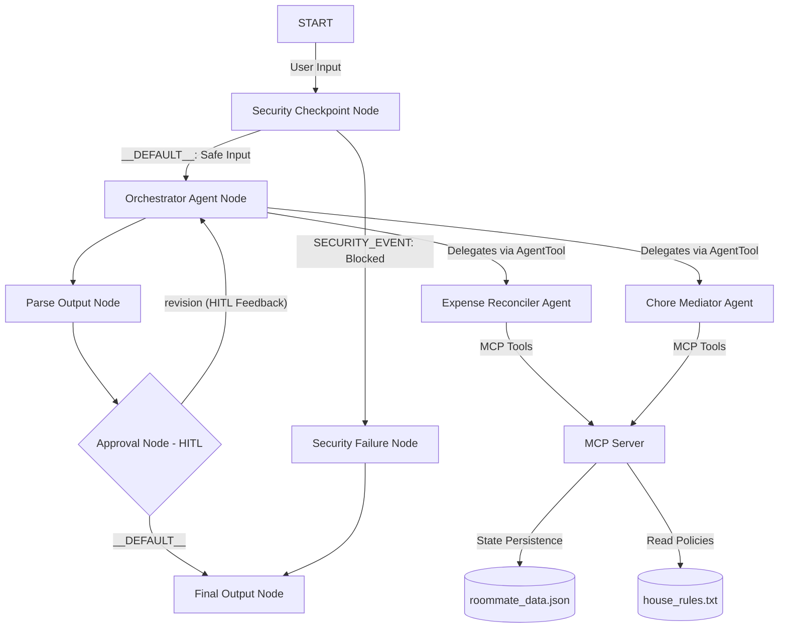

# Roommate Mediator — Submission Write-Up 🧑‍💼

---

## 1. Problem Statement
Living with roommates is a common way to split housing costs, but it frequently leads to friction. The three most common friction points in any shared household are:
1. **Expenses and Debts**: Unequal splits of bills, lack of transparency, and the awkwardness of asking friends to pay back money.
2. **Chores and Cleanliness**: Unequal chore division, forgetting who is assigned to what, and standard disagreements on clean/dirty rules.
3. **Disputes & House Policies**: Unclear quiet hour expectations or guest stay overstaying, causing arguments.

Existing apps (like Splitwise or Splitwise clones) only solve the math, but don't address the social communication, schedules, or mediating agreements when issues arise. Roommate Mediator acts as an objective, automated, and secure concierge agent that not only automates calculations and chore rotations but also draft friendly messages, checks house policies, and proposes fair compromises.

---

## 2. Solution Architecture
The Roommate Mediator agent is built using a secure multi-agent workflow graph:

---

## 3. Concepts Used

- **ADK Workflow**: The entire application is orchestrated via a deterministic graph definition in [app/agent.py](file:///d:/AI-agent/adk-worksspace/roommate-mediator/app/agent.py#L253-L268). 
- **LlmAgent**: Three separate agents represent intelligent nodes (`orchestrator_agent`, `expense_reconciler`, and `chore_mediator`) configured with `gemini-3.1-flash-lite` in [app/agent.py](file:///d:/AI-agent/adk-worksspace/roommate-mediator/app/agent.py#L23-L92).
- **AgentTool**: The `orchestrator_agent` uses `AgentTool` wrappers to call `expense_reconciler` and `chore_mediator` as modular tools in [app/agent.py](file:///d:/AI-agent/adk-worksspace/roommate-mediator/app/agent.py#L82).
- **MCP Server**: Implements standard stdio transport server exposing 8 tools in [app/mcp_server.py](file:///d:/AI-agent/adk-worksspace/roommate-mediator/app/mcp_server.py).
- **Security Checkpoint**: Implemented as a pre-agent `security_checkpoint` function node checking for prompt injection, scrubbing PII, and capping transactions at $5,000 in [app/agent.py](file:///d:/AI-agent/adk-worksspace/roommate-mediator/app/agent.py#L96-L180).
- **Agents CLI**: Project scaffolded, run, and verified locally using `agents-cli` tool suite.

---

## 4. Security Design
The system implements a multi-layer guardrail system before query processing:
1. **PII Redaction**: Regular expressions scan and replace telephone numbers, credit card numbers (critical for payment splitting), and emails with `[REDACTED]` markers to ensure personal information is never sent to the LLM backend.
2. **Prompt Injection Block**: Detects jailbreak keywords (e.g. `dan mode`, `ignore instructions`) and routes the workflow to `security_failure` immediately, preventing system instruction overrides.
3. **Domain Financial Cap Limit**: Intercepts calculations and blocks single bills splitting greater than $5,000 to prevent entry typos or malicious financial request floods.
4. **Structured Audit Log**: Outputs clean JSON log events to `stderr` recording decisions (`ALLOWED` or `BLOCKED`) with their corresponding severity (`INFO`, `WARNING`, `CRITICAL`) and session IDs.

---

## 5. MCP Server Design
Exposes 8 distinct tools connected to a state file (`roommate_data.json`) and a policy document (`house_rules.txt`):
- `get_balances()`: Returns who owes what in the household.
- `log_expense()`: Splits shared expenses equally and writes to the state database.
- `get_chore_schedule()`: Reads active household chore checklists.
- `mark_chore_done()`: Credits a roommate for completing a task.
- `calculate_utility_split()`: Computes utility shares and adds guidance for utility spikes.
- `generate_payment_link()`: Creates Venmo payment URLs.
- `rotate_chores()`: Shakes up chore assignments weekly for equity.
- `check_house_rules()`: Looks up complaints against the house agreement.

---

## 6. Human-in-the-Loop (HITL) Flow
To prevent the agent from communicating on behalf of a roommate without supervision, a strict Human-In-The-Loop gate is added:
- If `orchestrator_agent` drafts a payment reminder or suggests a rule dispute compromise, it flags it as `[NEEDS_APPROVAL]`.
- The `approval_node` catches this flag, interrupts execution, and yields a `RequestInput` payload to the UI.
- The user must explicitly approve with `yes` or provide revision feedback (which routes back to the orchestrator to redraft the response using the feedback).

---

## 7. Demo Walkthrough
1. **Test Case 1 (Split Bill)**: Paste `"Split a dinner bill of $90 paid by Alice."` in the playground. The agent calls the `log_expense` MCP tool, updating Bob and Charlie's balances to -$30.00 each.
2. **Test Case 2 (Rotate Chores)**: Inputting `"Rotate chores for the new week."` triggers the `rotate_chores` MCP tool, changing Alice, Bob, and Charlie's chore assignments and resetting completions.
3. **Test Case 3 (Mediated Reminder & HITL)**: Querying `"Draft a reminder message for Bob to pay Alice $30"` triggers the reconciler to draft the text, append a Venmo link, and trigger the HITL approval prompt asking for user validation.

---

## 8. Impact & Value Statement
Roommate Mediator reduces household tension by turning awkward conversations (reminding peers about money or dishes) into an objective, automated process. It ensures clear, itemized math, fair rotations of chores, and neutral rule auditing, helping roommates live together peacefully without personal friction.
